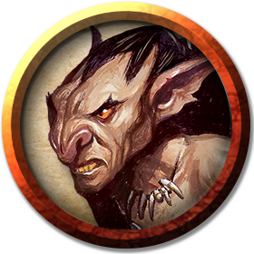

# Goblin Blind
---

_Encounter Details and Description_: See [Cragmaw Hideout 2. Goblin Blind](../locations/cragmaw-hideout.md#2-goblin-blind)

### Description
 - One Goblin has extra hairy face, full goblin beard.
 - One Goblin has a crude tattoo of a very tall goblin carrying a goblin in one hand walking on the beach.

 ### DM Notes
  - The tattoo'd goblin has a tattoo of [Bargrivyek](https://dungeonsdragons.fandom.com/wiki/List_of_Dungeons_%26_Dragons_goblinoid_deities). And evil goblin god who is all about cooperation between goblins. `DC 15 Religion` check to know this fact.

  ||[Beady](#goblin)|[Tattoo](#goblin)|
  |:-:|:-:|:-:|
  |HP|7|7|
  |AC|15|15|
  |Hit|+4|+4|
  |Dmg|d6+2s/p|d6+2s/p|

___
>## [Goblin](https://5e.tools/bestiary.html#goblin_mm)
>*Small humanoid (goblinoid), neutral evil*
>___
>- **Armor Class** 15 (leather armor, shield)
>- **Hit Points** 7 (2d6)
>- **Speed** 30 ft.
>___
>|STR|DEX|CON|INT|WIS|CHA|
>|:---:|:---:|:---:|:---:|:---:|:---:|
>|8 (-1)|14 (+2)|10 (+0)|10 (+0)|8 (-1)|8 (-1)|
>___
>- **Skills** Stealth +6
>- **Senses** darkvision 60 ft., passive Perception 9
>- **Languages** Common, Goblin
>- **Challenge** 1/4 (50 XP)
>- **Proficiency Bonus** +2
>___
>***Nimble Escape.*** The goblin can take the Disengage or Hide action as a bonus action on each of its turns.  
>
>### Actions
>***Scimitar.*** *Melee Weapon Attack:* +4 to hit, reach 5 ft., one target. *Hit:* 5 (1d6 + 2) slashing damage.  
>
>***Shortbow.*** *Ranged Weapon Attack:* +4 to hit, range 80/320 ft., one target. *Hit:* 5 (1d6 + 2) piercing damage.

---
[Back](./encounters.md)