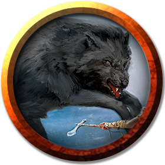

# Klarg's Cave
---

_Encounter Details and Description_: See [Cragmaw Hideout 8. Klarg's Cave](../locations/cragmaw-hideout.md#8-klargs-cave)

### Description
- A bugbear, a wolf, and 2 goblins.
- Bugbear named Klarg has monical frame in one eye, missing it's glass.
- Wolf looks mangy.
- One goblin is missing an ear.
- One goblin has unusually long legs.

### DM Notes
- If goblin from [area 7](../locations/cragmaw-hideout.md#7-twin-pools-cave) warns them, then Klarg will order the goblins to stand ready, while he hides with his wolf to try and surprise the party.
- If not warned, then good chance party can surprise Klarg. Advantage if they come from the fissure.

### Treasure
- If supplies are loaded onto the wagon, and returned, 50gp and friendship of [Lionshield Coster](../locations/phandalin.md#lionshield-coster).
- Chest with the following:
  - 600cp
  - 110sp
  - 2x [Potion of Healing](https://5e.tools/items.html#potion%20of%20healing_dmg)
  - Jade frog statuette with golden orb eyes. (40gp)

||[Monical (Klarg)](#bugbear)|[Mangy](#wolf)|[No Ear](#goblin)|[Long Legs](#goblin)*|
|:-:|:-:|:-:|:-:|:-:|
|HP|27|11|7|7|
|AC|16|13|15|15|
|Hit|+4|+4|+4|+4|
|Dmg|2d8+2p|2d4+2p|d6+2s/p|d6+2s/p|

___
>## [Bugbear](https://5e.tools/bestiary.html#bugbear_mm)
>*Medium humanoid (goblinoid), chaotic evil*
>___
>- **Armor Class** 16 (hide armor, shield)
>- **Hit Points** 27 (5d8 + 5)
>- **Speed** 30 ft.
>___
>|STR|DEX|CON|INT|WIS|CHA|
>|:---:|:---:|:---:|:---:|:---:|:---:|
>|15 (+2)|14 (+2)|13 (+1)|8 (-1)|11 (+0)|9 (-1)|
>___
>- **Skills** Stealth +6, Survival +2
>- **Senses** darkvision 60 ft., passive Perception 10
>- **Languages** Common, Goblin
>- **Challenge** 1 (200 XP)
>- **Proficiency Bonus** +2
>___
>***Brute.*** A melee weapon deals one extra die of its damage when the bugbear hits with it (included in the attack).  
>
>***Surprise Attack.*** If the bugbear surprises a creature and hits it with an attack during the first round of combat, the target takes an extra 7 (2d6) damage from the attack.  
>
>### Actions
>***Morningstar.*** *Melee Weapon Attack:* +4 to hit, reach 5 ft., one target. *Hit:* 11 (2d8 + 2) piercing damage.  
>
>***Javelin.*** *Melee  or Ranged Weapon Attack:* +4 to hit, reach 5 ft. or range 30/120 ft., one target. *Hit:* 9 (2d6 + 2) piercing damage in melee or 5 (1d6 + 2) piercing damage at range.

___
>## [Goblin](https://5e.tools/bestiary.html#goblin_mm)
>*Small humanoid (goblinoid), neutral evil*
>___
>- **Armor Class** 15 (leather armor, shield)
>- **Hit Points** 7 (2d6)
>- **Speed** 30 ft.
>___
>|STR|DEX|CON|INT|WIS|CHA|
>|:---:|:---:|:---:|:---:|:---:|:---:|
>|8 (-1)|14 (+2)|10 (+0)|10 (+0)|8 (-1)|8 (-1)|
>___
>- **Skills** Stealth +6
>- **Senses** darkvision 60 ft., passive Perception 9
>- **Languages** Common, Goblin
>- **Challenge** 1/4 (50 XP)
>- **Proficiency Bonus** +2
>___
>***Nimble Escape.*** The goblin can take the Disengage or Hide action as a bonus action on each of its turns.  
>
>### Actions
>***Scimitar.*** *Melee Weapon Attack:* +4 to hit, reach 5 ft., one target. *Hit:* 5 (1d6 + 2) slashing damage.  
>
>***Shortbow.*** *Ranged Weapon Attack:* +4 to hit, range 80/320 ft., one target. *Hit:* 5 (1d6 + 2) piercing damage.

___
>## [Wolf](https://5e.tools/bestiary.html#wolf_mm)
>*Medium beast, unaligned*
>___
>- **Armor Class** 13 (natural armor)
>- **Hit Points** 11 (2d8 + 2)
>- **Speed** 40 ft.
>___
>|STR|DEX|CON|INT|WIS|CHA|
>|:---:|:---:|:---:|:---:|:---:|:---:|
>|12 (+1)|15 (+2)|12 (+1)|3 (-4)|12 (+1)|6 (-2)|
>___
>- **Skills** Perception +3, Stealth +4
>- **Senses** passive Perception 13
>- **Languages** —
>- **Challenge** 1/4 (50 XP)
>- **Proficiency Bonus** +2
>___
>***Keen Hearing and Smell.*** The wolf has advantage on Wisdom (Perception) checks that rely on hearing or smell.  
>
>***Pack Tactics.*** The wolf has advantage on an attack roll against a creature if at least one of the wolf's allies is within 5 feet of the creature and the ally isn't incapacitated.  
>
>### Actions
>***Bite.*** *Melee Weapon Attack:* +4 to hit, reach 5 ft., one target. *Hit:* 7 (2d4 + 2) piercing damage. If the target is a creature, it must succeed on a DC 11 Strength saving throw or be knocked prone.

---
[Back](./encounters.md)