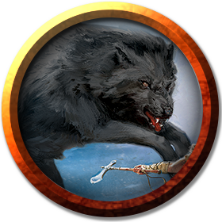

# Kennel
---

_Encounter Details and Description_: [3. Kennel](../locations/cragmaw-hideout.md#3-kennel)

### Description
 - One wolf has a long scar across one milky eye.
 - One wolf has a bright white patch of fur on it's rump.
 - One wolf has extra long ears.

||[Scar](#wolf)|[Patches](#wolf)|[Ears](#wolf)|
|:-:|:-:|:-:|:-:|
|HP|11|11|11|
|AC|13|13|13|
|Hit|+4|+4|+4|
|Dmg|2d4+2p|2d4+2p|2d4+2p|

___
>## [Wolf](https://5e.tools/bestiary.html#wolf_mm)
>*Medium beast, unaligned*
>___
>- **Armor Class** 13 (natural armor)
>- **Hit Points** 11 (2d8 + 2)
>- **Speed** 40 ft.
>___
>|STR|DEX|CON|INT|WIS|CHA|
>|:---:|:---:|:---:|:---:|:---:|:---:|
>|12 (+1)|15 (+2)|12 (+1)|3 (-4)|12 (+1)|6 (-2)|
>___
>- **Skills** Perception +3, Stealth +4
>- **Senses** passive Perception 13
>- **Languages** —
>- **Challenge** 1/4 (50 XP)
>- **Proficiency Bonus** +2
>___
>***Keen Hearing and Smell.*** The wolf has advantage on Wisdom (Perception) checks that rely on hearing or smell.  
>
>***Pack Tactics.*** The wolf has advantage on an attack roll against a creature if at least one of the wolf's allies is within 5 feet of the creature and the ally isn't incapacitated.  
>
>### Actions
>***Bite.*** *Melee Weapon Attack:* +4 to hit, reach 5 ft., one target. *Hit:* 7 (2d4 + 2) piercing damage. If the target is a creature, it must succeed on a DC 11 Strength saving throw or be knocked prone.

---
[Back](./encounters.md)