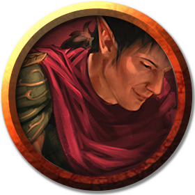

# Redband Ruffians
---

_From_: [The Sleeping Giant](../locations/phandalin.md#the-sleeping-giant)

**Description**
- Can happen as an encounter in the street or in the [The Sleeping Giant](../locations/phandalin.md#the-sleeping-giant).
- If in [The Sleeping Giant](../locations/phandalin.md#the-sleeping-giant).
  - Under covered porch.
  - Four humans leaning on or sitting on empty ale barrels.
  - Spits
  - Makes dumb threat about puppies there to bark at them.
- If in street.
  - Four humans wait in back ally for party to come through.
  - Spits
  - Hands on weapons.
  - "Time for you to move on, give us your stuff then leave town."
- All wearing grimy red cloaks.
- One has babies first goatee.
- One has an ugly scar on left side of face.
- One has really striking blue eyes.
- One has a lot of teeth missing.

**GM Notes**
- When 3 are defeated, the 4th runs away to [Redbrand Hideout](../locations/redbrand-hideout.md), under [Tresendar Manor](../locations/phandalin.md#tresendar-manor).
- If captured and persuaded or charmed, knows this [information](../locations/redbrand-hideout.md#what-they-know).

||[Goatee](#redbrand-ruffian)|[Scar](#redbrand-ruffian)|[Blue Eyes](#redbrand-ruffian)|[Missing Teeth](#redbrand-ruffian)|
|:-:|:-:|:-:|:-:|:-:|
|HP|16|16|16|16|
|AC|14|14|14|14|
|Hit|+4 (x2)|+4 (x2)|+4 (x2)|+4 (x2)|
|Dmg|d6+2|d6+2|d6+2|d6+2|

___
>## Redbrand Ruffian
>*Medium humanoid (human), neutral evil*
>___
>- **Armor Class** 14 (studded leather)
>- **Hit Points** 16 (3d8 + 3)
>- **Speed** 30 ft.
>___
>|STR|DEX|CON|INT|WIS|CHA|
>|:---:|:---:|:---:|:---:|:---:|:---:|
>|11 (+0)|14 (+2)|12 (+1)|9 (-1)|9 (-1)|11 (+0)|
>___
>- **Skills** Intimidation +2
>- **Senses** passive Perception 9
>- **Languages** Common
>- **Challenge** 1/2 (100 XP)
>- **Proficiency Bonus** +2
>___
>### Actions
>***Multiattack.*** The ruffian makes two melee attacks.  
>
>***Shortsword.*** *Melee Weapon Attack:* +4 to hit, reach 5 ft., one target. *Hit:* 5 (1d6 + 2) piercing damage.

---
[Back](./encounters.md)