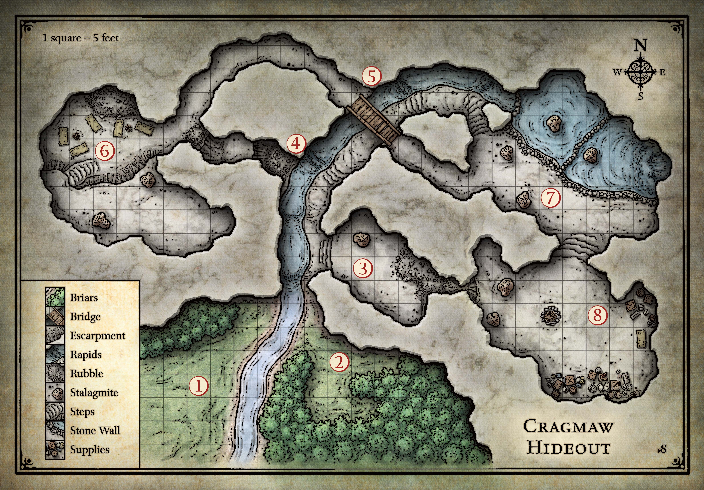

# Cragmaw Hideout
---

[Player Version](./images/cragmaw-hideout-player.jpeg)

### Instructions
- Start at [area 1](#1-cave-mouth)
- After exploring this, party will probably head to [Phandalin](../locations/phandalin.md). But they might also set out for [Cragmaw Castle](../locations/cragmaw-castle.md)

### Features
- High 20-30 foot ceilings.
- Area's [1](#1-cave-mouth) and [2](#2-goblin-blind) outside. Rest is in darkness.
- Rock's are [difficult terrain](https://5e.tools/quickreference.html#bookref-quick,3,difficult%20terrain).
- Cave muffles sound, `DC 15 Perception` check to hear anything.
- Stalagmites provide [cover](https://5e.tools/quickreference.html#bookref-quick,3,cover).
- Stream moves slowly and is only 2 feet deep and cold.

#### Captured Goblin
If the players captured a goblin, they might get it to reveal the following.
 - Lair contains about 15 goblins.
 - Leader is a bugbear named Klarg.
 - Klarg answers to [King Grol](../npcs/king-grol.md), and in [Cragmaw Castle](./cragmaw-castle.md).
 - Goblin can give a rough directions to [Cragmaw Castle](./cragmaw-castle.md).

### Points of Interest
>### 1. Cave Mouth
**Description**
 - Large cave in hillside.
 - Shallow stream flows out.
 - Dense briar thickets screen the cave.
 - Dry path on [east](#2-goblin-blind) side of stream.

**DM Notes**  
 - Lots of noise will alert the lazy goblins in area [2](#2-goblin-blind).

>### 2. Goblin Blind
**Description**
 - Briar hedge providing a blind for goblin lookout.
 - Lookout consists of some wooden board layed on the briar.

**DM Notes**
 - Splashing across the stream alerts the goblins, no surprise.
 - Careful party could stealth and surprise the goblins.
 - Run encounter [Goblin Blind](../encounters/cragmaw-hideout-2-goblin-blind.md).

>### 3. Kennel
**Description**
 - Narrow path leading into the cavern, a sharp right and up some stairs.
 - Sounds and smells of savage animals up ahead.
 - Come into cavern and 3 wolves chained to iron rods driven into stalagmites.  
 _**After Entering Room**_
 - 30 foot fissure in east wall leading up.

 **DM Notes**  
 - 3 wolves will attack anyone who enters the room. Run encounter [Kennel](../encounters/cragmaw-hideout-3-kennel.md).
 - `DC 15 Animal Handling` check to calm the wolves. Drops to `DC 10` if wolves are fed.
 - Every round the players don't enter the room, `DC 15 Str` check (`+1`) for the wolves to pull the rods free and attack the party.
 - A 30 foot fissure in the east wall can be climbed up with `DC 10 Athletics` check every 10 feet to make it to [area 8](#8-klargs-cave). On a 5 or less character falls, takes `d6 bludgeoning` damage per 10 feet.
 
>### 4. Steep Passage
**Description**
- Ahead the passage climbs next to the falling water of the stream, and veers off to the east.
- Darkvision just allows players to see an old bridge above them ahead in [area 5](#5-overpass).
- `PP 13` with darkvision to notice a goblin stealthily  guarding the bridge.
- To the west is a passage strewn with debris. It is [difficult terrain](https://5e.tools/quickreference.html#bookref-quick,3,difficult%20terrain). And has a very steep climb about 10 to a ledge.

**DM Notes**
- The goblin in [area 5](#5-overpass) will sneak off to warn its fellows in [area 7](#7-twin-pools-cave) and unleash the flood. Players must be make a `DC 9 stealth` check with no lights to avoid this.
- Western passage is dangerous. `PP 12` to notice the steep ledge can't hold much weight.
- Any player more then 100lbs who climbs up will trigger a collapse.

>### 5. Overpass
**Description**
- Stream continues up and another set of uneven steps continues in that direction.
- A rickety looking bridge spawns above the walkway.

**DM Notes**
- Lazy goblin stands guard on bridge, if characters make a `DC 9 Stealth` check with no light sources he won't notice them. Otherwise he runs off to [area 7](#7-twin-pools-cave) and triggers the flood event. If this happens run encounter [Tiwn Pools Cave](../encounters/cragmaw-hideout-7-twin-pools-cave.md#dm-notes).
- If party comes here after dealing with [area 7](#7-twin-pools-cave), run encounter [Twin Pools Cave](../encounters/cragmaw-hideout-7-twin-pools-cave.md), but with only pothead. And he'll try and run away.
- Players will notice the goblin with a `PP 13`.
- Bridge has `AC5`; `HP10`. `2d6 bludgeoning` damage to anything that falls when bridge is destroyed.
- Can climb onto bridge with `DC 15 Athletics` check.
- Bridge connects [area 6](#6-goblin-den) and [area 7](#7-twin-pools-cave).

>### 6. Goblin Den
**Description**
- 10ft. high cliff halfway into room with stairs leading down.
- Hazy air from cook fires.
- Pungent smell from poorly cured hides, unwashed goblins.
- 6 goblins and tied up tied up human in cave. Human and leader Yeemik are near the cliff.

**DM Notes**
- [Sildar Hallwinter](../npcs/sildar-hallwinter.md) is tied up on the far side of the cave from where the players enter. He's at 1 HP.
- Run encounter [Twin Pools Cave](../encounters/cragmaw-hideout-7-twin-pools-cave.md).

**Information**
If [Sildar](../npcs/sildar-hallwinter.md) lives, he reveals the following information to the players.
- [Gundren](../npcs/gundren-rockseeker.md), Tharden, and [Nundro](../npcs/nundro-rockseeker.md) Rockseeker have discovered the location of the [Wave Echo Cave](../locations/wave-echo-cave.md).
- He knows the [Wave Echo Cave](../locations/wave-echo-cave.md) is a mine that a group of dwarves and gnomes allied together in the Phandelver's Pact to exploit. Along with great wealth it also had great magic. And a group of human wizards helped them create a magical forge called the Forge of Spells, that dwarves could use to create magical items. Until a group of evil wizards and orcs attacked the cave, and the ensuing battle destroyed most of it, and left the entrance lost to time.
- He knows that Klarg, a bugbear, leads this band of goblins, and was told to capture [Gundren](../npcs/gundren-rockseeker.md) by something called the Black Spider. He was sent to someplace called [Cragmaw Castle](../locations/cragmaw-castle.md), along with a map that reveals where [Wave Echo Cave](../locations/wave-echo-cave.md) is.
- He tells the party his reason for traveling to [Phandalin](../locations/phandalin.md) was to locate another Lords' Alliance member, [Iarno Albrek](../npcs/iarno-albrek.md), a wizard sent to set up shop in [Phandalin](../locations/phandalin.md), but has not been in contact.
- He offers the part 50gp to escort him to [Phandalin](../locations/phandalin.md), though he doesn't have it now, he can get it a day after they get there.
- He will stay with the party, but has no weapons or armor. He'll use a shortsword from a goblin, or any weapon the players might loan him.

>### 7. Twin Pools Cave
**Description**
- Cave is half filled with water, unless Flood happened.
- A waterfall feeds the pool of water.
- The pool drains into the stream that leads out.
- Lots of piled stones make a dam.
- Large exit farside of cavern.
- Hard to hear anything in here, because of waterfall.

**DM Notes**
- Run encounter [Twin Pools Cave](../encounters/cragmaw-hideout-7-twin-pools-cave.md)

>### 8. Klarg's Cave
**Description**
- Large sacks of provisions, with a blue lion stamped on them in the south.
- A sloping floor to the west leads to a narrow opening that descends into darkness.
- Some stone steps leads north, sound of crashing water from that direction.
- Large fire pit with smoldering coals in the middle of the room.

**DM Notes**
- Klarg speaks in the 3rd person.
- Fire pit deals `1 fire` damage, or `d6 fire` damage is falling into.
- Opening in west of room leads down to [area 3](#3-kennel). Can be climbed up with `DC 10 Athletics` check every 10 feet. On a 5 or less character falls, takes `d6 bludgeoning` damage per 10 feet.
- Provisions are the property of the [Lionshield Coster](../locations/phandalin.md#lionshield-coster) in [Phandalin](../locations/phandalin.md#lionshield-coster.md).
- Run encounter [Klarg's Cave](../encounters/cragmaw-hideout-8-klargs-cave.md).