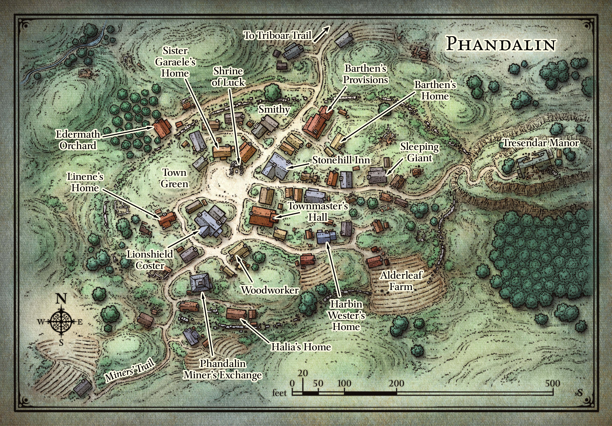

# Phandalin (Fan-Duh-Lin)
---

[Player Version](./images/phandalin-player.jpeg)  
[Alderleaf Farm](#alderleaf-farm) | [Barthens Provisions](#barthens-provisions) | [Edermath Orchard](#edermath-orchard) | [Lionshield Coster](#lionshield-coster)  
[Phandalin Miner's Exchange](#phandalin-miners-exchange) | [Shirne of Luck](#shirne-of-luck) | [The Sleeping Giant](#the-sleeping-giant) | [Stonehill Inn](#stonehill-inn)  
[Townmaster's Hall](#townmasters-hall) | [Tresendar Manor](#tresendar-manor)

### History
The town was once destroyed by evil wizards, and orcs hundreds of years ago. In the last four years or so it has been rebuilt by settlers from cities in the Sword Coast.

### Description
 - 40-50 simple log buildings.
 - Old moss covered stone ruins are mixed in with new wooden buildings.
 - Muddy cart track snakes through town, ultimately leading to ruined manor house on a high hill.
 - Children are at play on the town green, and townsfolk are running errands.
 - If [Sildar](../npcs/sildar-hallwinter.md) is with the party he suggests the party heads to the [Stonehill Inn](#stonehill-inn).

 ### **Event - Redbrands**

### Points of Interest
>### Alderleaf Farm
>### Barthens Provisions
**Description**
- Large log building with large red letters that say "Barthens Provisions".

**DM Notes**
- Sells any [adventuring gear](https://5e.tools/quickreference.html#bookref-quick,1,adventuring%20gear) up to 25gp in cost.
- Does not sell weapons.
- Two clerks work here, Ander and Thistle.
- Propriteor is [Elmar Barthen](../npcs/elmar-barthen.md).
  - If characters deliver supplies, [Elmar](../npcs/elmar-barthen.md) will pay them 10gp each.
  - Is sad to hear of [Gundren Rockseeker](../npcs/gundren-rockseeker.md), and encourages party to find him.
  - Tells them about [Wave Echo Cave](../locations/wave-echo-cave.md) if [Sildar Hallwinter](../npcs/sildar-hallwinter.md) didn't. See [Goblin Den](../locations/cragmaw-hideout.md#6-goblin-den).
  - Tells party about [Nundro](../npcs/nundro-rockseeker.md) and Tharden Rockseeker, [Gundren's](../npcs/gundren-rockseeker.md) brothers. They are camping somewhere out of town, and haven't been seen in a tenday, so they are due any day for a resupply.
    - He doesn't know Tharden is dead, and [Nundro](../npcs/nundro-rockseeker.md) is trapped in [Wave Echo Cave](../locations/wave-echo-cave.md).
  - If asked about business, [Elmar](../npcs/elmar-barthen.md) tells them the [Redbrands](#event---redbrands) are shaking businesses down, and flouting the [townmaster's](#townmasters-hall) authority. Suggests if the party wants to deal with them they can be found at [The Sleeping Giant](#the-sleeping-giant).

>### Edermath Orchard
**Description**
- Cottage next to apple orchard.

**DM Notes**
- Owned by [Daran Edermath](../npcs/daran-edermath.md), retired adventurer.
- [Daran](../npcs/daran-edermath.md) doesn't like the [Redbrands](#event---redbrands), and espcially their leader, Glasstaff. He knows they hang out in [The Sleeping Giant](#the-sleeping-giant), but that their [main headquarters](../locations/redbrand-hideout.md) is under [Tresendar Manor](#tresendar-manor).
- [Daran](../npcs/daran-edermath.md) asks the players if they'd be willing to go to the [Old Owl Well](../locations/old-owl-well.md) couple of days northeast. He's heard of miners being chased away from the area, and rumors of undead. There is an old Netheril tower there, and it might have old wrong magics.

>### Lionshield Coster
>### Phandalin Miner's Exchange
>### Shirne of Luck
>### The Sleeping Giant
>### Stonehill Inn
**Description**
- Located in center of town.
- Make of fieldstone and rough-hewn timbers.
- Common room filled with towns folk, all eyeing you.
- Young man wearing an apron calls to you from the bar.

**DM Instructions**
- 6 Rooms for rent, [Sildar](../npcs/sildar-hallwinter.md) rents one. Costs 8sp per night for a comfortable room.
- Meals are 5sp.
- Ale 4cp.
- [Toblen Stonehill](../npcs/toblen-stonehill.md) greets the players.
  - Came to town looking to mine, was better inn keeper.
  - Dislikes [Harbin Wester](../npcs/harbin-wester.md), the townmaster, because he has been letting the [Redbrands](#event---redbrands) harass the town.
  - Can't do anything directly about the [Redbrands](#event---redbrands) out of fear for his family.

**Rumors**  
`Roll d6`
 1. "[Sister Garaele](../npcs/sister-garaele.md), who oversees the Shrine of Luck, recently left town for a few days, then returned wounded and exhausted." - Small group of old men, or Narth an old farmer.
 2. "[Daran Edermath](../npcs/daran-edermath.md), the orchard keeper, is a former adventurer." - Elsa, the barmaid, talking to player or another table.
 3. "Orc raiders have been seen on the east end of [Triboar Trail](../locations/triboar-trail.md). The [townmaster](#townmasters-hall) is looking for someone to run them off." - A group of mines, or Lanar a miner.
 4. "Thel Dendrar, a local woodcarver, stood up to the [Redbrands](#event---redbrands) a tenday ago when they came by his shop and leered at his wife. The ruffians murdered him. Several townsfolk saw it happen. The [Redbrands](#event---redbrands) grabbed his body, and now his wife, daughter, and son have gone missing too." - Trilna, innkeeper's wife, talking to a table, or the players.
 5. "[Qelline Alderleaf](../npcs/qelline-alderleaf.md) son Carp said he found a secret tunnel in the woods, but Redbrands almost caught him." - Pip, innkeeper's son talking to some other children before they run out to play.
 6. "The [Redbrands](#event---redbrands) hassle every business in town, except for the Phandalin Miner's Exchange. They don't want trouble with [Halia Thornton](../npcs/halia-thornton.md), who runs it." - A group of weaver women talking, or Freda, a weaver, talking to the players.
>### Townmaster's Hall
>### Tresendar Manor

---
[Back](./locations.md)