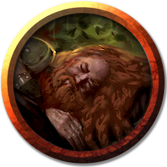

# Gundren Rockseeker
---

### Important Info
 - Is the initial employer of the party, set into motion the [Cold Opening](../plot/cold-opening.md).

### Stat Block
>## [Gundren Rockseeker](https://5e.tools/bestiary.html#gundren%20rockseeker_lmop)
>*Medium humanoid (dwarf), any alignment*
>___
>- **Armor Class** 10
>- **Hit Points** 4 (1d8)
>- **Speed** 25 ft. 
>___
>|STR|DEX|CON|INT|WIS|CHA|
>|:---:|:---:|:---:|:---:|:---:|:---:|
>|10 (+0)|10 (+0)|10 (+0)|10 (+0)|10 (+0)|10 (+0)|
>___
>- **Damage Resistances** poison
>- **Senses** darkvision 60 ft., passive Perception 10
>- **Languages** any one language (usually Common), Dwarvish
>- **Challenge** 0 (0 or 10 XP)
>- **Proficiency Bonus** +2
>___
>***Dwarven Resilience.*** Gundren has advantage on saving throws against poison, and has resistance against poison damage.  
>
>### Actions
>***Club.*** *Melee Weapon Attack:* +2 to hit, reach 5 ft., one target. *Hit:* 2 (1d4) bludgeoning damage.

---
[Back](./npcs.md)